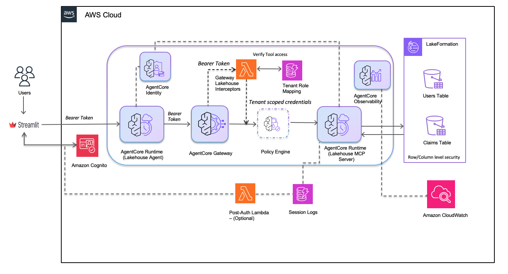

# Lakehouse Agent Deployment Guide (DevOps)

This guide provides the deployment sequence for the Lakehouse Agent system using command-line scripts. For a guided notebook-based approach, see the Jupyter notebooks in the parent directory.

The deployment is organized in two phases:

- **Phase 1 — Base lakehouse-agent (Steps 1–7, this guide).** Deploys Cognito,
  IAM tenant roles, S3 Tables + Lake Formation, the MCP server, the Gateway
  with request/response Interceptors, and the conversational agent.
- **Phase 2 — Advanced AgentCore Policy + Interceptor (optional, CDK).** Layers
  Cedar-based AgentCore Policy on top of Phase 1 and upgrades the request
  Interceptor with geography-based access control. See
  [advanced-agentcore-policy-gateway-interceptor/README.md](advanced-agentcore-policy-gateway-interceptor/README.md).

## Architecture



The diagram above shows the end-to-end architecture deployed by this guide:
users authenticate with Amazon Cognito from the Streamlit UI, the AgentCore
Runtime (Lakehouse Agent) forwards the bearer token to the AgentCore Gateway,
and the Gateway Interceptors validate tool access and exchange the JWT for
tenant-scoped IAM credentials via the Tenant Role Mapping table. Those
credentials let the MCP server query Athena / S3 Tables under Lake Formation
row- and column-level security. AgentCore Identity, Observability, and the
optional Post-Auth Lambda / Session Logs round out the operational surface.
Phase 2 adds the **Policy Engine** between the Gateway and the MCP server so
Cedar rules can deny tool calls declaratively (shown with a dashed outline in
the diagram).

## Prerequisites

1. AWS CLI configured with appropriate permissions
2. Python 3.10+ with virtual environment
3. Docker running (for AgentCore Runtime deployments)
4. `bedrock-agentcore-starter-toolkit` installed

### AWS Region Configuration

All deployment scripts read the AWS region from your boto3 session. Configure it before running any scripts:

```bash
# Option 1: Set via AWS CLI profile (recommended)
aws configure set region us-east-1 --profile your-profile

# Option 2: Set via environment variable
export AWS_REGION=us-east-1

# Option 3: Set the default region
export AWS_DEFAULT_REGION=us-east-1

# Verify your region
aws configure get region
```

> **Note**: Amazon Bedrock AgentCore is available in select regions. Verify [regional availability](https://docs.aws.amazon.com/general/latest/gr/bedrock-agent-core.html) before choosing a region.

### Setup

```bash
# Setup virtual environment
cd 02-use-cases/lakehouse-agent
python -m venv .venv
source .venv/bin/activate
pip install -r requirements.txt
pip install bedrock-agentcore-starter-toolkit
```

## Deployment Sequence

### Step 1: Deploy Cognito

Creates User Pool, OAuth clients, groups (policyholders, adjusters, administrators), and test users.
Automatically configures Post-Authentication trigger if Lambda exists.

```bash
cd deployment/1-cognito-setup
python setup_cognito.py
```

SSM Parameters created:

- `/app/lakehouse-agent/cognito-user-pool-id`
- `/app/lakehouse-agent/cognito-user-pool-arn`
- `/app/lakehouse-agent/cognito-app-client-id`
- `/app/lakehouse-agent/cognito-app-client-secret` (SecureString)
- `/app/lakehouse-agent/cognito-m2m-client-id`
- `/app/lakehouse-agent/cognito-m2m-client-secret` (SecureString)
- `/app/lakehouse-agent/cognito-domain`
- `/app/lakehouse-agent/cognito-resource-server-id`
- `/app/lakehouse-agent/cognito-region`

Test users created:

- `policyholder001@example.com` → policyholders group
- `policyholder002@example.com` → policyholders group
- `adjuster001@example.com` → adjusters group
- `adjuster002@example.com` → adjusters group
- `admin@example.com` → administrators group

Default password: `TempPass123!`

> **Important — first-time sign-in required.** `setup_cognito.py` creates users with the default password as a _temporary_ password, so every user starts in Cognito `FORCE_CHANGE_PASSWORD` state. `admin_initiate_auth` returns a `NEW_PASSWORD_REQUIRED` challenge (not an `AuthenticationResult`) until each user signs in once and completes the challenge. The Streamlit UI (Step 8) has a built-in challenge handler — launch it and sign in once per user, setting the new password to the same `TempPass123!` (the user pool does not configure `PasswordHistorySize`, so reusing the value is allowed). Only after this step will plain `admin_initiate_auth` calls (for example, from `verify_policy.py` in the Phase 2 sample) succeed.

#### Optional: Enable Login Audit Logging

To enable login audit logging, deploy the Post-Authentication Lambda before running setup_cognito.py:

```bash
# Deploy Lambda and DynamoDB table first
bash deploy_post_auth_lambda.sh

# Then run setup (will automatically configure the trigger)
python setup_cognito.py
```

Or add the trigger to an existing User Pool:

```bash
# Deploy Lambda if not already deployed
bash deploy_post_auth_lambda.sh

# Add trigger to existing pool
python setup_cognito.py --add-post-auth-trigger
```

This creates:

- DynamoDB table: `lakehouse_user_login_audit`
- Lambda function: `lakehouse-cognito-post-auth`
- IAM role: `lakehouse-cognito-post-auth-role`

See [POST_AUTH_SETUP.md](1-cognito-setup/POST_AUTH_SETUP.md) for details.

---

### Step 2: Deploy IAM Roles for Tenant Groups

Creates IAM roles for policyholders, adjusters, and administrators groups with Athena/S3 permissions.
These roles are required before setting up Lake Formation permissions on S3 Tables.

```bash
cd ../2-lakehouse-tenant-roles-setup
python setup_iam_roles.py
```

SSM Parameters created:

- `/app/lakehouse-agent/roles/lakehouse-policyholders-role`
- `/app/lakehouse-agent/roles/lakehouse-adjusters-role`
- `/app/lakehouse-agent/roles/lakehouse-administrators-role`

---

### Step 3: Deploy S3 Tables Database

Creates S3 Tables bucket, namespace, tables (claims, users), and S3 bucket for query results.
Integrates S3 Tables with Lake Formation and configures permissions for tenant roles (requires roles from Step 2).

#### 3a. Grant Lake Formation Admin Permissions (One-time Setup)

Before running the integration script, your AWS role needs Lake Formation administrator permissions.

**Option 1: AWS Console**

1. Go to AWS Lake Formation console
2. Navigate to "Administrative roles and tasks" → "Data lake administrators"
3. Click "Choose administrators"
4. Add your IAM role (e.g., `arn:aws:iam::{account_id}:role/YourRole`)
5. Click "Save"

**Option 2: AWS CLI**

```bash
# Get current Lake Formation admins
aws lakeformation get-data-lake-settings --region us-east-1

# Add your role (replace with your role ARN)
aws lakeformation put-data-lake-settings \
  --data-lake-settings '{
    "DataLakeAdmins": [
      {
        "DataLakePrincipalIdentifier": "arn:aws:iam::123456789012:role/YourRole"
      }
    ]
  }' \
  --region us-east-1
```

#### 3b. Integrate S3 Tables with Lake Formation

```bash
cd ../3-s3tables-setup
python integrate_s3tables_lakeformation.py
```

This script:

- Creates IAM role for Lake Formation data access
- Registers S3 Tables bucket with Lake Formation (with federation enabled)
- Creates federated catalog `s3tablescatalog` for S3 Tables
- Grants the calling principal permissions on the catalog

SSM Parameters created:

- `/app/lakehouse-agent/lakeformation-role-arn`
- `/app/lakehouse-agent/s3tables-catalog-name`

#### 3c. Create S3 Tables

```bash
python setup_s3tables.py  # Uses default: lakehouse-{account_id}-{random}
# Or specify custom name:
# python setup_s3tables.py --table-bucket-name my-lakehouse
```

SSM Parameters created:

- `/app/lakehouse-agent/table-bucket-name`
- `/app/lakehouse-agent/table-bucket-arn`
- `/app/lakehouse-agent/namespace`
- `/app/lakehouse-agent/catalog-name`
- `/app/lakehouse-agent/s3-bucket-name`

#### 3d. Configure Lake Formation Permissions

```bash
python setup_lakeformation_permissions.py
```

Lake Formation permissions configured:

- Grants database and table permissions to tenant roles (from Step 2)
- Configures column-level access for row-level security
- Sets up data filters for policyholders (user_id column)

#### 3e. Load Sample Data

```bash
python load_sample_data.py
```

This script assumes the administrators role (created in Step 2) to insert data via Athena.
The admin role has Lake Formation permissions granted in Step 3d.

---

### Step 4: Deploy MCP Server

Deploys the MCP Athena server to AgentCore Runtime.

```bash
cd ../4-mcp-lakehouse-server
python deploy_runtime.py --yes
```

SSM Parameters created:

- `/app/lakehouse-agent/mcp-server-runtime-arn`

---

### Step 5: Deploy Gateway Interceptors

Deploys the request and response interceptor Lambdas and creates the tenant role mapping table.

#### 5a. Deploy Request Interceptor

```bash
cd ../5-gateway-setup/interceptor-request
./deploy.sh
```

This script:

1. Packages Lambda function with dependencies (python-jose, cryptography)
2. Creates Lambda execution role
3. Deploys request interceptor Lambda function
4. Creates DynamoDB table `lakehouse_tenant_role_map`
5. Seeds tenant-to-role mappings with allowed tools

SSM Parameters created:

- `/app/lakehouse-agent/interceptor-lambda-arn`
- `/app/lakehouse-agent/interceptor-lambda-role-arn`
- `/app/lakehouse-agent/tenant-role-mapping-table`

#### 5b. Deploy Response Interceptor

```bash
cd ../interceptor-response
./deploy.sh
```

This script:

1. Packages Lambda function with dependencies (python-jose, cryptography)
2. Uses shared Lambda execution role from request interceptor
3. Deploys response interceptor Lambda function
4. Filters tool list based on user group permissions from DynamoDB
5. Always removes system tools (e.g., x_amz_bedrock_agentcore_search)

SSM Parameters created:

- `/app/lakehouse-agent/response-interceptor-lambda-arn`

---

### Step 6: Deploy AgentCore Gateway

Creates the Gateway connecting to MCP server with request and response interceptors.

```bash
cd ..
python create_gateway.py --yes
```

SSM Parameters created:

- `/app/lakehouse-agent/gateway-arn`

---

### Step 7: Deploy Lakehouse Agent

Deploys the conversational AI agent to AgentCore Runtime.

```bash
cd ../6-lakehouse-agent
python deploy_lakehouse_agent.py --yes
```

SSM Parameters created:

- `/app/lakehouse-agent/agent-runtime-arn`

---

### Step 8: Run Streamlit UI (Optional)

```bash
cd ../../streamlit-ui
streamlit run streamlit_app.py
```

Access at: http://localhost:8501

---

### Step 9 (Optional): Layer AgentCore Policy + Design 3 Interceptor (Phase 2)

To add declarative Cedar-based access control and geography-aware request
enrichment on top of the Phase 1 Gateway, follow
[advanced-agentcore-policy-gateway-interceptor/README.md](advanced-agentcore-policy-gateway-interceptor/README.md).

This Phase 2 deployment adds:

- `CfnPolicyEngine` with four Cedar policies (`permit_all` + three `forbid` rules).
- An IAM inline policy granting the existing Gateway role policy-evaluation permissions.
- A single `UpdateGateway` call that re-attaches both Interceptors together with
  the Policy Engine in `ENFORCE` mode.
- An upgraded request Interceptor Lambda that injects user geography so Cedar
  can enforce data-residency rules (Design 3).

Prerequisite: Phase 1 Steps 1–7 must be deployed first — the CDK stack reads
every ARN / ID it needs from SSM parameters populated by those steps.

---

## Quick Reference

| Step         | Directory                                       | Command                                           |
| ------------ | ----------------------------------------------- | ------------------------------------------------- |
| 1            | `1-cognito-setup`                               | `python setup_cognito.py`                         |
| 2            | `2-lakehouse-tenant-roles-setup`                | `python setup_iam_roles.py`                       |
| 3a           | Lake Formation Console/CLI                      | Grant Lake Formation admin permissions (one-time) |
| 3b           | `3-s3tables-setup`                              | `python integrate_s3tables_lakeformation.py`      |
| 3c           | `3-s3tables-setup`                              | `python setup_s3tables.py`                        |
| 3d           | `3-s3tables-setup`                              | `python setup_lakeformation_permissions.py`       |
| 3e           | `3-s3tables-setup`                              | `python load_sample_data.py`                      |
| 4            | `4-mcp-lakehouse-server`                        | `python deploy_runtime.py --yes`                  |
| 5a           | `5-gateway-setup/interceptor-request`           | `./deploy.sh`                                     |
| 5b           | `5-gateway-setup/interceptor-response`          | `./deploy.sh`                                     |
| 6            | `5-gateway-setup`                               | `python create_gateway.py --yes`                  |
| 7            | `6-lakehouse-agent`                             | `python deploy_lakehouse_agent.py --yes`          |
| 8            | `streamlit-ui`                                  | `streamlit run streamlit_app.py`                  |
| 9 (optional) | `advanced-agentcore-policy-gateway-interceptor` | `bash scripts/pre-deploy.sh && npx cdk deploy`    |

---

## Directory Structure

```
deployment/
├── 1-cognito-setup/                      # Step 1
│   ├── setup_cognito.py
│   └── cleanup_cognito.py
├── 2-lakehouse-tenant-roles-setup/       # Step 2
│   ├── setup_iam_roles.py
│   └── cleanup_iam_roles.py
├── 3-s3tables-setup/                     # Step 3
│   ├── integrate_s3tables_lakeformation.py
│   ├── setup_s3tables.py
│   ├── setup_lakeformation_permissions.py
│   ├── load_sample_data.py
│   ├── verify_setup.py
│   └── cleanup_s3tables.py
├── 4-mcp-lakehouse-server/               # Step 4
│   ├── deploy_runtime.py
│   └── cleanup_runtime.py
├── 5-gateway-setup/                      # Steps 5-6
│   ├── interceptor-request/              # Step 5a
│   │   ├── deploy.sh
│   │   ├── lambda_function.py
│   │   ├── token_exchange.py
│   │   ├── tool_validation.py
│   │   └── setup_dynamodb_tenant_role_maps.py
│   ├── interceptor-response/             # Step 5b
│   │   ├── deploy.sh
│   │   ├── lambda_function.py
│   │   └── README.md
│   ├── create_gateway.py                 # Step 6
│   └── cleanup_gateway.py
├── 6-lakehouse-agent/                    # Step 7
│   ├── deploy_lakehouse_agent.py
│   └── cleanup_agent.py
└── advanced-agentcore-policy-gateway-interceptor/   # Step 9 (optional, Phase 2)
    ├── README.md
    ├── bin/app.ts
    ├── lib/policy-stack.ts
    ├── policies/              # Cedar policies (Design 1 + Design 3)
    ├── lambda/interceptor-request/  # Design 3 Lambda source
    ├── scripts/               # pre-deploy + cdk.json generation
    └── verification/
        └── verify_policy.py
```

---

## Verify Deployment

Check all SSM parameters:

```bash
aws ssm get-parameters-by-path \
  --path /app/lakehouse-agent/ \
  --recursive \
  --query 'Parameters[*].[Name,Value]' \
  --output table
```

---

## Cleanup

Each deployment step has a dedicated cleanup script. Run them in reverse order.

**If you deployed Phase 2 (Step 9), destroy it first** — it depends on the
Phase 1 Gateway and the Gateway role, so Phase 1 cleanup will fail while the
Policy Engine is still attached.

```bash
# Step 9 (Phase 2): Destroy Policy Engine + Cedar policies + role inline policy.
# Interceptors remain attached; the CDK stack only added the Policy Engine.
cd advanced-agentcore-policy-gateway-interceptor
npx cdk destroy --force
cd ..
```

See [advanced-agentcore-policy-gateway-interceptor/README.md#cleanup](advanced-agentcore-policy-gateway-interceptor/README.md#cleanup) for notes on rolling back the Design 3 Lambda source before Phase 1 cleanup.

Then run the Phase 1 cleanup scripts:

```bash
# Step 7: Delete Lakehouse Agent
cd 6-lakehouse-agent
python cleanup_agent.py

# Step 6/5: Delete Gateway, interceptors, DynamoDB mapping table
cd ../5-gateway-setup
python cleanup_gateway.py

# Step 4: Delete MCP Server Runtime
cd ../4-mcp-lakehouse-server
python cleanup_runtime.py

# Step 3: Delete S3 Tables, Lake Formation integration
cd ../3-s3tables-setup
python cleanup_s3tables.py

# Step 2: Delete IAM tenant roles
cd ../2-lakehouse-tenant-roles-setup
python cleanup_iam_roles.py

# Step 1: Delete Cognito User Pool, Lambda, DynamoDB audit table
cd ../1-cognito-setup
python cleanup_cognito.py
```

All cleanup scripts support `--keep-ssm` to preserve SSM parameters for re-deployment.

To delete remaining SSM parameters manually:

```bash
aws ssm delete-parameters --names $(aws ssm get-parameters-by-path \
  --path /app/lakehouse-agent/ --recursive \
  --query 'Parameters[*].Name' --output text)
```
