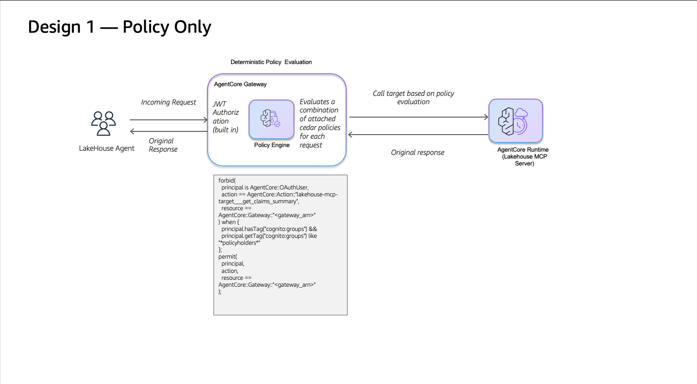
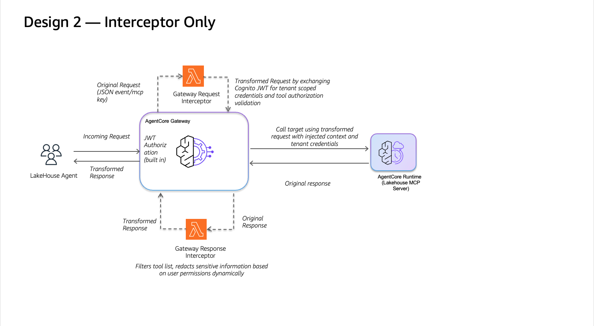
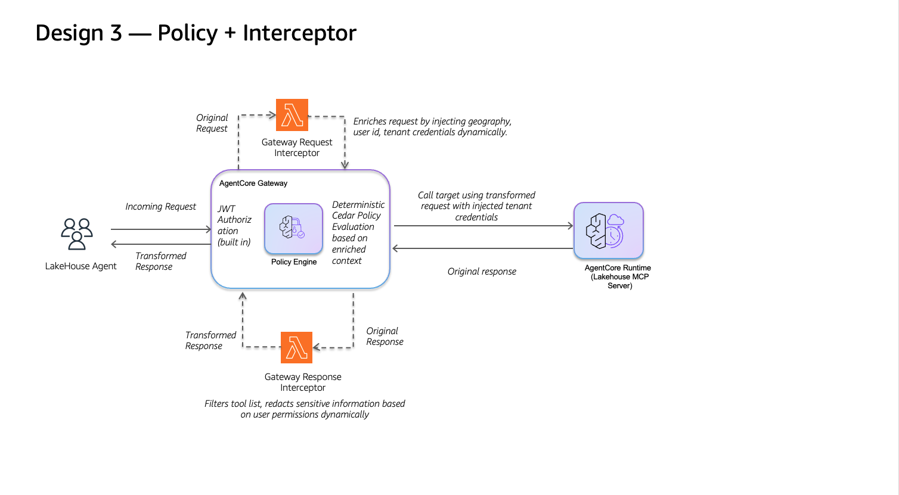

# Advanced Amazon Bedrock AgentCore Policy + Lambda Interceptor (CDK)

This CDK project extends the lakehouse-agent sample with a layered security
architecture that combines **Cedar-based AgentCore Policy** and a **Design 3
Request Interceptor Lambda**. It implements the three patterns described in
the blog post _"Build Secure AI Agent Behavior with Policy and Lambda
Interceptors in Amazon Bedrock AgentCore"_:

| Design                              | Mechanism                                                                                                                    | Demo rule                                                    |
| ----------------------------------- | ---------------------------------------------------------------------------------------------------------------------------- | ------------------------------------------------------------ |
| **Design 1 — Policy Only**          | Cedar `forbid` rule on the Gateway                                                                                           | Policyholders cannot invoke `get_claims_summary`             |
| **Design 2 — Interceptor Only**     | Request Interceptor performs `sts:AssumeRole` to scope credentials, so Lake Formation applies row- and column-level security | Each user sees only their own rows and permitted columns     |
| **Design 3 — Policy + Interceptor** | Interceptor injects `geography`, Cedar evaluates `context.input.geography`                                                   | EU users cannot invoke `query_claims` or `get_claim_details` |

## Architecture

The three designs differ in _where_ the access decision is made. Each diagram
below highlights the control point exercised at request time.

### Design 1 — Policy Only



The AgentCore Gateway evaluates Cedar policies before forwarding the request to
the MCP server. Access control is **declarative** — the Policy Engine denies
disallowed tool invocations (for example, `get_claims_summary` for
policyholders) without any custom Lambda logic in the request path.

### Design 2 — Interceptor Only



The Request Interceptor Lambda performs `sts:AssumeRole` to downscope the
credentials passed to the MCP server based on the user's tenant role mapping.
The downstream query to Athena / S3 Tables then runs under a tenant-scoped
role, letting **Lake Formation** apply row- and column-level security
transparently.

### Design 3 — Policy + Interceptor



Combines both control points: the Request Interceptor enriches the request by
injecting `geography` (and still downscopes credentials), then the Policy
Engine evaluates Cedar rules against that attribute via
`context.input.geography`. This enables **attribute-based access control**
(e.g., blocking `query_claims` / `get_claim_details` for EU users) that
neither Design 1 nor Design 2 can express on its own.

## Prerequisites

This CDK sample runs **after the base lakehouse-agent is deployed** (Steps 1–7
in [deployment/README.md](../README.md)). It reads every input — Gateway ARN,
interceptor Lambda ARNs, Cognito IDs, etc. — from the SSM parameters produced
by those steps.

Required tooling:

- AWS credentials with permissions to create AgentCore Policy Engine and
  Cedar policies (`bedrock-agentcore:*`), update the Gateway, and attach IAM
  inline policies to the Gateway role.
- AWS CLI v2 configured for the same account and region as the base deployment.
- Node.js 18+ and npm.
- Python 3.10+ (for the pre-deploy and verification scripts) with the same
  virtual environment used for Phase 1.

> **Region note**: All commands below assume `AWS_REGION=us-east-1`, matching
> the base lakehouse-agent deployment. Export `AWS_REGION` before running any
> step if your shell default differs.

> **MCP target ownership**: `lakehouse-mcp-target` referenced by the Cedar
> policies is the first-party MCP server deployed by Phase 1 Step 4
> (`deployment/4-mcp-lakehouse-server/`). It is part of this sample and is
> licensed under the Apache License 2.0 (see [LICENSE](../../../../../LICENSE)).
> It is not a third-party dependency and requires no separate legal review.

## Directory layout

```
advanced-agentcore-policy-gateway-interceptor/
├── README.md                       # (this file)
├── package.json / tsconfig.json    # CDK TypeScript project
├── cdk.json.example                # Template — cdk.json is generated at deploy-time
├── bin/app.ts                      # CDK entry point (reads account/region from context)
├── lib/policy-stack.ts             # PolicyStack: Policy Engine + Cedar policies + Gateway re-attach
├── policies/                       # Cedar source (one file per policy)
├── lambda/interceptor-request/     # Design 3 Request Interceptor Lambda source
├── scripts/
│   ├── pre-deploy.sh               # Runs the 3 steps below in one go
│   ├── generate-cdk-context.sh     # Generates cdk.json from SSM
│   └── detach-interceptors.py      # Detaches Interceptors before Cedar policy creation
└── verification/
    └── verify_policy.py            # 13-check FGAC regression suite
```

## Deploy

### Step 1 — Pre-deploy

`pre-deploy.sh` does three things in sequence:

1. **Generate `cdk.json`** from SSM Parameter Store (account ID is derived
   from `aws sts get-caller-identity`).
2. **Detach the Interceptors** from the Gateway. Cedar policy creation sends
   internal MCP validation requests that are SigV4-signed (not Bearer-token
   authenticated), which fail against a JWT-validating Interceptor. CDK
   re-attaches both Interceptors together with the Policy Engine in Step 2.
3. **Overwrite the base `interceptor-request/lambda_function.py`** with the
   Design 3 version (adds user geography injection) and redeploy that Lambda.

```bash
cd 02-use-cases/lakehouse-agent/deployment/advanced-agentcore-policy-gateway-interceptor
AWS_REGION=us-east-1 bash scripts/pre-deploy.sh
```

### Step 2 — CDK deploy

```bash
npm ci
# Bootstrap once per account/region if you have not deployed any CDK stack yet:
# npx cdk bootstrap
npx cdk deploy --require-approval never
```

This creates:

- **`CfnPolicyEngine`** — the AgentCore Policy Engine.
- **`CfnPolicy` x 4** — Cedar policies from `policies/*.cedar`. `permit_all`
  is created first (with `IGNORE_ALL_FINDINGS` to bypass the Overly Permissive
  warning), then the three `forbid` policies in parallel.
- **IAM inline policy** on the existing Gateway role for
  `bedrock-agentcore:AuthorizeAction` etc.
- **`AwsCustomResource` → `UpdateGateway`** — re-attaches both Interceptors
  and attaches the Policy Engine in `ENFORCE` mode in a single API call.

Deployment takes about 2 minutes.

### Step 3 — Verify the Policy Engine is active

```bash
AWS_REGION=us-east-1 python3 -c "
import boto3
client = boto3.Session(region_name='us-east-1').client('bedrock-agentcore-control')
for e in client.list_policy_engines().get('policyEngines', []):
    if 'Lakehouse' in e['name']:
        print(f'Engine: {e[\"policyEngineId\"]} ({e[\"status\"]})')
        for p in client.list_policies(policyEngineId=e['policyEngineId']).get('policies', []):
            print(f'  {p[\"name\"]}: {p[\"status\"]}')
"
```

All four policies should report `ACTIVE`.

> **Before running Step 4: each Cognito user must sign in once.** `verify_policy.py` authenticates via plain `admin_initiate_auth`, which fails while users are still in Cognito `FORCE_CHANGE_PASSWORD` state (the default for users created by Phase 1 `setup_cognito.py`). Start the Streamlit UI (`streamlit run streamlit-ui/streamlit_app.py`) and sign in **once per user** — `policyholder001`, `policyholder002`, `adjuster001`, `adjuster002`, and `admin` — completing the `NEW_PASSWORD_REQUIRED` challenge. Re-entering the same `TempPass123!` as the new password works because the user pool does not set `PasswordHistorySize`. After this one-time step, `verify_policy.py` will authenticate cleanly.

### Step 4 — Run the end-to-end verification

```bash
cd ../../..                                  # back to lakehouse-agent/
source .venv/bin/activate                    # same venv used for Phase 1
export LAKEHOUSE_TEST_PASSWORD='TempPass123!'  # match the password set by Phase 1 setup_cognito.py
python deployment/advanced-agentcore-policy-gateway-interceptor/verification/verify_policy.py
```

Expected output:

```
Results: 13/13 passed
```

## What the policies enforce

| Policy file                         | Pattern         | Effect                                                                                       |
| ----------------------------------- | --------------- | -------------------------------------------------------------------------------------------- |
| `permit_all.cedar`                  | Baseline permit | Without this, AgentCore defaults to deny-by-default once a Policy Engine is attached         |
| `forbid_policyholder_summary.cedar` | Design 1        | Blocks `get_claims_summary` when `principal.getTag("cognito:groups") like "*policyholders*"` |
| `forbid_eu_individual_claims.cedar` | Design 3        | Blocks `query_claims` and `get_claim_details` when `context.input.geography == "EU"`         |
| `forbid_restricted_geography.cedar` | Design 3        | Blocks every tool when `context.input.geography == "RESTRICTED"`                             |

The `geography` attribute is injected by the Design 3 Request Interceptor at
`params.arguments.geography` (top level). Cedar maps that to
`context.input.geography`. The demo Lambda ships a hard-coded mapping in
`USER_GEOGRAPHY` — replace with a DynamoDB lookup for production.

## Security Considerations

### Threat Model

| ID  | Threat                                                                              | Priority | Mitigation                                                                                                    | Verification (in `verify_policy.py`)                              |
| --- | ----------------------------------------------------------------------------------- | -------- | ------------------------------------------------------------------------------------------------------------- | ----------------------------------------------------------------- |
| T1  | Cross-tenant data access (one policyholder reading another's claims)                | Critical | Design 2 token exchange (`sts:AssumeRole`) + Lake Formation row-level security (Phase 1 Step 2 + Step 3)      | `test_data_isolation` + `test_column_masking`                     |
| T2  | Privilege escalation via tool selection (policyholder invoking adjuster-only tools) | High     | Design 1 Cedar `forbid` rule on `get_claims_summary` for the `policyholders` Cognito group                    | `test_tool_access(get_claims_summary, DENY)`                      |
| T3  | Data residency violation (EU user accessing individual claim records)               | Medium   | Design 3 geography injection by the Request Interceptor + Cedar `forbid` evaluating `context.input.geography` | `test_tool_access(query_claims, DENY)` for `policyholder002` (EU) |

### Service-specific Security Guidelines

- **Amazon Bedrock AgentCore Gateway**: keep the `CUSTOM_JWT` authorizer with `discoveryUrl` validation (configured in `lib/policy-stack.ts`). Run the Policy Engine in `ENFORCE` mode for production; switch to `LOG_ONLY` only when validating new policies.
- **Amazon Bedrock AgentCore Policy**: `permit_all.cedar` uses `IGNORE_ALL_FINDINGS` only as the baseline permit; all `forbid` policies use `FAIL_ON_ANY_FINDINGS` for stricter validation.
- **Amazon DynamoDB** (tenant role mappings, used by Design 2): enable point-in-time recovery and KMS encryption at rest in production. Restrict the interceptor Lambda's IAM role to specific table ARNs.
- **AWS Lake Formation**: row- and column-level grants are managed by Phase 1 `deployment/3-s3tables-setup/`. Audit grants periodically.
- **Amazon S3 Tables**: keep table buckets in the same region as the Athena workgroup. Use Lake Formation permissions for table-level access rather than bucket policies.
- **Amazon Athena**: use a dedicated workgroup with `ResultConfiguration` pointing to a KMS-encrypted result bucket; enforce result-set encryption.
- **AWS Systems Manager Parameter Store**: store `cognito-app-client-secret` as `SecureString`. Read with `WithDecryption=True` (the interceptor and verification scripts already do this). Rotate per your secrets policy.

### Shared Responsibility

AWS manages the underlying Amazon Bedrock AgentCore Gateway, Policy Engine, AWS Lambda runtime, and Amazon Cognito control plane. **You** are responsible for: Cedar policy correctness, the `USER_GEOGRAPHY` mapping (today hard-coded; move to Amazon DynamoDB for production — see line above), tenant role mappings in Amazon DynamoDB, AWS Lake Formation grants, AWS IAM role trust policies, Amazon Cognito user-pool password and MFA policies, and Amazon CloudWatch log retention / forwarding configuration.

### Data Classification and Handling

| Data type                                | Classification | Handling                                                                                                                    |
| ---------------------------------------- | -------------- | --------------------------------------------------------------------------------------------------------------------------- |
| JWT bearer tokens                        | Confidential   | Validated by the request interceptor; never logged in full. Only `username` / `sub` claims are emitted to logs.             |
| IAM session credentials (token exchange) | Restricted     | Returned by `sts:AssumeRole`, scoped to the request, and expire on session end (1 h max).                                   |
| Cognito user pool ID / app client ID     | Internal       | Stored in AWS Systems Manager Parameter Store; read with `WithDecryption=True` for forward-compatibility with SecureString. |
| Cognito app client secret                | Confidential   | Stored as SSM SecureString; decrypted at read time only.                                                                    |
| Synthetic insurance claims data          | Internal       | Generated procedurally by Phase 1 `deployment/3-s3tables-setup/`; contains no real-world records.                           |
| Geography attribute                      | Internal       | Injected at request time by the Design 3 interceptor; not persisted.                                                        |

### Key Management

- **This sample**: relies on AWS-managed default keys (`aws/ssm`, `aws/lambda`, `aws/s3`) for at-rest encryption to keep the deployment minimal.
- **Production**: replace with **customer-managed AWS KMS keys** for SSM SecureString parameters, AWS Lambda environment variables, the Amazon DynamoDB tenant role mapping table, the Amazon S3 Tables result bucket, and Amazon CloudWatch Logs.
- **Rotation**: enable automatic annual rotation on all customer-managed keys.
- **Access**: grant `kms:Decrypt` and `kms:GenerateDataKey` only to the Gateway role and the request interceptor Lambda role; do not grant cross-account access without an explicit need.
- **Naming**: use a consistent alias scheme such as `alias/lakehouse-agent/<service>` for traceability.

#### CloudWatch Logs encryption (production hardening)

This stack already configures a 30-day retention policy for both interceptor Lambda log groups (`lib/policy-stack.ts` Step 3.5). For production, also associate the log groups with a customer-managed AWS KMS key. The commands below assume `AWS_REGION` and `AWS_ACCOUNT_ID` are exported.

```bash
# 1. Create a customer-managed key and an alias.
KEY_ID=$(aws kms create-key \
    --description "Lakehouse interceptor CloudWatch Logs encryption" \
    --key-usage ENCRYPT_DECRYPT \
    --query 'KeyMetadata.KeyId' --output text)
aws kms create-alias \
    --alias-name alias/lakehouse-agent/cloudwatch-logs \
    --target-key-id "$KEY_ID"

# 2. Allow CloudWatch Logs in the current region to use the key
#    (see https://docs.aws.amazon.com/AmazonCloudWatch/latest/logs/encrypt-log-data-kms.html
#    for the full key policy template — CloudWatchLogsServicePrincipal must be granted
#    kms:Encrypt*, kms:Decrypt*, kms:ReEncrypt*, kms:GenerateDataKey*, and kms:Describe*).

# 3. Associate the key with both interceptor log groups.
KEY_ARN="arn:aws:kms:${AWS_REGION}:${AWS_ACCOUNT_ID}:key/${KEY_ID}"
aws logs associate-kms-key \
    --log-group-name /aws/lambda/lakehouse-gateway-interceptor \
    --kms-key-id "$KEY_ARN"
aws logs associate-kms-key \
    --log-group-name /aws/lambda/lakehouse-gateway-response-interceptor \
    --kms-key-id "$KEY_ARN"

# 4. Enable annual key rotation.
aws kms enable-key-rotation --key-id "$KEY_ID"
```

After association, every new log stream is encrypted with the customer-managed key. Existing log events remain encrypted with the previous key; rotate logs (or set a shorter retention) if you need uniform coverage.

### Security Validation

- **Static analysis**: this sample is scanned with internal AWS Holmes content-security tooling on every PR; the latest scan completed with 0 Critical findings.
- **Cedar policy validation**: each `policies/*.cedar` file is validated by the AgentCore Policy Engine via `validationMode` — `IGNORE_ALL_FINDINGS` for the baseline `permit_all` and `FAIL_ON_ANY_FINDINGS` for every `forbid` policy (see `lib/policy-stack.ts:80-82`).
- **End-to-end verification**: `verification/verify_policy.py` exercises 13 access-control assertions across the 3 designs (see Step 4 above) and is expected to report `Results: 13/13 passed` after a clean deploy.
- **Manual review**: Cedar rules and IAM policies in `lib/policy-stack.ts` are reviewed for least privilege before merge.
- **Measurable outcomes** (post-deploy state checks):
  - `python deployment/advanced-agentcore-policy-gateway-interceptor/verification/verify_policy.py` → `Results: 13/13 passed`
  - `aws logs describe-log-groups --log-group-name-prefix /aws/lambda/lakehouse-gateway --query 'logGroups[].retentionInDays'` → `[30, 30]`
  - `aws bedrock-agentcore-control list-policies --policy-engine-id <id> --query 'policies[].status'` → all `ACTIVE`
- **Audit trail**: scanned by Holmes baseline `HolmesContentSecurityReviewBaselinePolicy v3` on 2026-05-05 (HIGH=13), 2026-05-13 (HIGH=6), 2026-05-25 (HIGH=3). Remediation rationale for each cycle is tracked in `plans/`. Findings are self-attested by the sample maintainers; reports are committed under `02-use-cases/lakehouse-agent/scan-report*.json`.

## Disclaimer

The examples provided in this repository are for experimental and educational purposes only. They demonstrate concepts and techniques but are not intended for direct use in production environments. Make sure to have [Amazon Bedrock Guardrails](https://docs.aws.amazon.com/bedrock/latest/userguide/guardrails.html) in place to protect against [prompt injection](https://docs.aws.amazon.com/bedrock/latest/userguide/prompt-injection.html).

**Note on data**: this sample uses **synthetic insurance claims data** generated procedurally by Phase 1 `deployment/3-s3tables-setup/` scripts. The dataset contains no real-world records, no PII, and no PHI; it is generated at deployment time, distributed under the same Apache-2.0 license as this sample, and does not fall under HIPAA, PCI DSS, GDPR, or other data protection regulations. Adapting this sample for production workloads with real data requires a separate compliance review beyond the scope of this CDK project.

## Cleanup

Destroy **in reverse order**. Phase 2 first, then Phase 1.

### Phase 2 — This CDK stack

```bash
cd 02-use-cases/lakehouse-agent/deployment/advanced-agentcore-policy-gateway-interceptor
npx cdk destroy --force
```

`cdk destroy` does the following via the `AwsCustomResource`
and the `CfnPolicy` / `CfnPolicyEngine` resource lifecycles:

1. Detaches the Policy Engine from the Gateway (Interceptors remain attached).
2. Deletes the four Cedar policies.
3. Deletes the Policy Engine.
4. Removes the inline IAM policy from the Gateway role.

> **Note:** The Design 3 Request Interceptor Lambda source (with geography
> injection) remains deployed after `cdk destroy`. That is intentional — the
> Lambda is a Phase 1 resource and is cleaned up in the Phase 1 cleanup below.
> If you want to roll back to the original Phase 1 Lambda (without geography
> injection) before destroying Phase 1, restore
> `deployment/5-gateway-setup/interceptor-request/lambda_function.py` from git
> and redeploy:
>
> ```bash
> git checkout -- deployment/5-gateway-setup/interceptor-request/lambda_function.py
> cd deployment/5-gateway-setup/interceptor-request
> AWS_REGION=us-east-1 ./deploy.sh
> ```

### Phase 1 — Base lakehouse-agent

Follow the standard cleanup in the parent guide — each Phase 1 step has a
dedicated cleanup script, run in reverse order:

```bash
cd 02-use-cases/lakehouse-agent/deployment
cd 6-lakehouse-agent              && python cleanup_agent.py
cd ../5-gateway-setup             && python cleanup_gateway.py
cd ../4-mcp-lakehouse-server      && python cleanup_runtime.py
cd ../3-s3tables-setup            && python cleanup_s3tables.py
cd ../2-lakehouse-tenant-roles-setup && python cleanup_iam_roles.py
cd ../1-cognito-setup             && python cleanup_cognito.py
```

See [../README.md](../README.md) for details.

## Troubleshooting

| Symptom                                                   | Cause                                                                                                       | Fix                                                                                                |
| --------------------------------------------------------- | ----------------------------------------------------------------------------------------------------------- | -------------------------------------------------------------------------------------------------- |
| `CfnPolicy` → `CREATE_FAILED` with `InterceptorException` | The Gateway still had the JWT-validating Interceptor attached while Cedar tried its internal MCP validation | Re-run `scripts/pre-deploy.sh` (it detaches Interceptors) then `cdk deploy` again                  |
| All tool calls return 500                                 | After detach, the Response Interceptor Lambda was missing when CDK re-attached                              | Deploy the Response Interceptor first: `deployment/5-gateway-setup/interceptor-response/deploy.sh` |
| `permit_all` fails with "Overly Permissive"               | `validationMode: FAIL_ON_ANY_FINDINGS` on a broad permit                                                    | PolicyStack already uses `IGNORE_ALL_FINDINGS` for `permit_all` — rerun `cdk deploy`               |
| `context.input` returns `attribute not found`             | Cedar rule used a wildcard `action`                                                                         | List tools explicitly in `action in [...]` (see `forbid_eu_individual_claims.cedar`)               |
| Every tool returns DENY after deploy                      | `permit_all` is not `ACTIVE`                                                                                | Re-check `list_policies` status; if not ACTIVE, re-run `cdk deploy`                                |

## References

- Blog post: _Build Secure AI Agent Behavior with Policy and Lambda Interceptors in Amazon Bedrock AgentCore_
- [Phase 1 deployment guide](../README.md)
- [lakehouse-agent README](../../README.md)

## License

This project is licensed under the Apache License 2.0 — see the [LICENSE](../../../../../LICENSE) file at the repository root for details.
