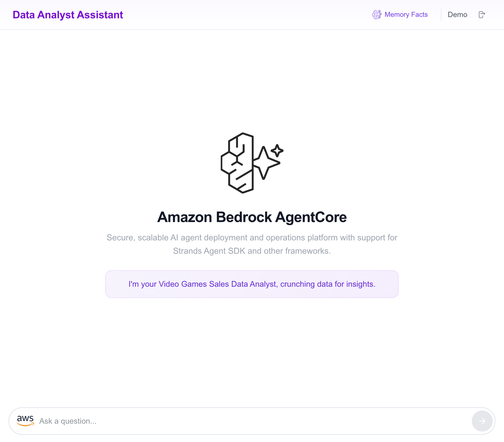
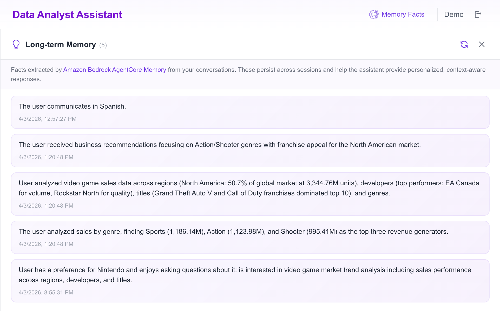
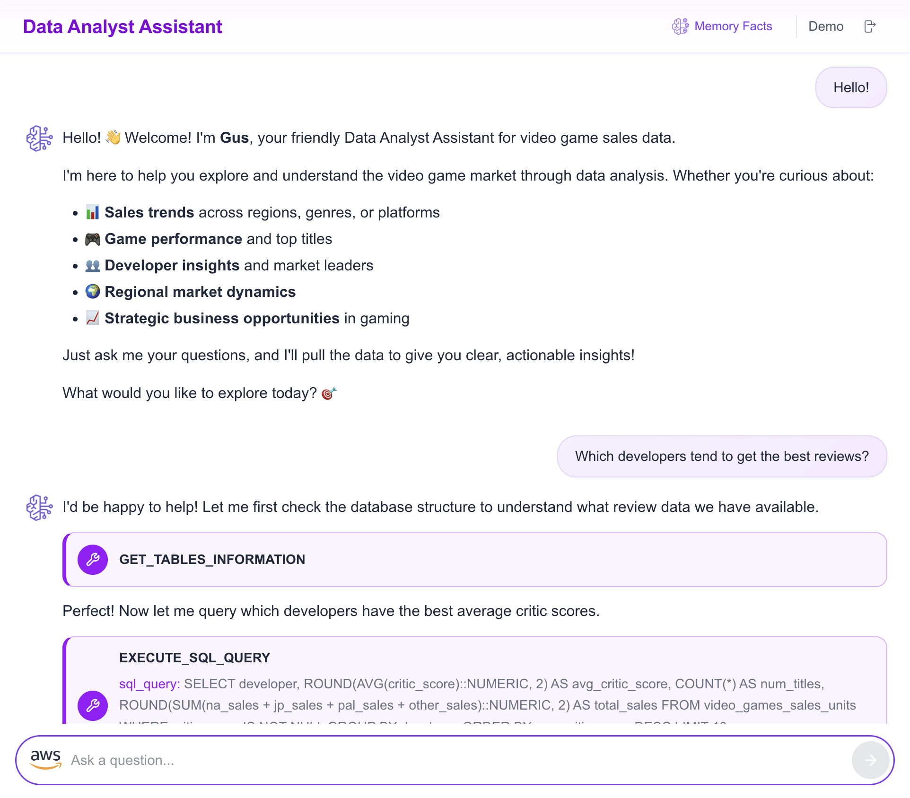
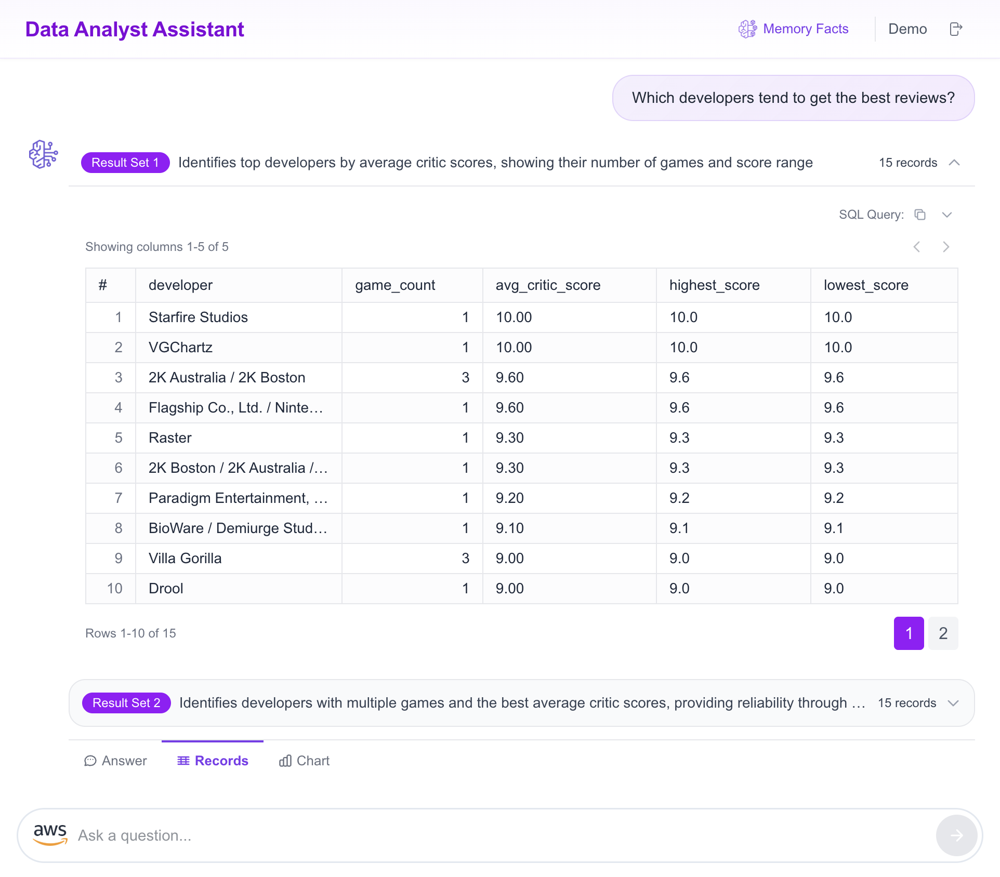
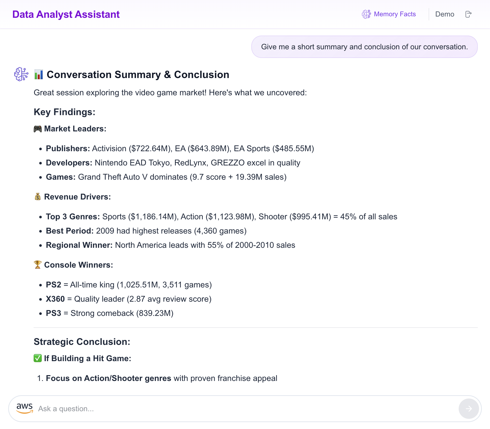

# Front-End Implementation - Integrating AgentCore with a Ready-to-Use Data Analyst Assistant Application (Next.js)

This tutorial guides you through setting up a Next.js web application that integrates with your **[Amazon Bedrock AgentCore](https://aws.amazon.com/bedrock/agentcore/)** deployment, creating a Data Analyst Assistant for Video Game Sales.

This is the Next.js + Amplify Gen 2 version of the original React application. It uses the same AgentCore backend but replaces the React + Amplify Gen 1 frontend with a modern Next.js App Router architecture, Tailwind CSS, and Amplify Gen 2 for authentication and IAM.

> [!NOTE]
> **Working Directory**: Make sure you are in the `amplify-video-games-sales-assistant-agentcore-strands/` folder before starting this tutorial. All commands in this guide should be executed from this directory.

## Overview

By the end of this tutorial, you'll have a fully functional Generative AI web application that allows users to interact with a Data Analyst Assistant interface powered by Amazon Bedrock AgentCore.

The application consists of two main components:

- **Next.js Web Application**: Provides the user interface with server components, protected routes, and streaming chat
- **Amazon Bedrock AgentCore Integration:**
    - Uses your AgentCore deployment for data analysis and natural language processing
    - The application invokes Amazon Bedrock AgentCore for interacting with the assistant
    - Directly invokes Claude Haiku 4.5 model for chart generation and visualization

> [!IMPORTANT]
> This sample application is for demonstration purposes only and is not production-ready. Please validate the code against your organization's security best practices.

## Prerequisites

Before you begin, ensure you have:

- [Node.js version 18+](https://nodejs.org/en/download/package-manager)
- [pnpm](https://pnpm.io/installation)
- [AWS CLI](https://docs.aws.amazon.com/cli/latest/userguide/install-cliv2.html) configured with credentials
- A deployed Amazon Bedrock AgentCore runtime (from the CDK stack in this repository)

Verify credentials:

```bash
aws sts get-caller-identity
```

## Set Up the Front-End Application

### Install Dependencies

Navigate to the application folder and install the dependencies:

```bash
pnpm install
```

## Configure Environment Variables

Run the following script to automatically copy the example file, fetch the CDK output values, and update your `.env.local`:

```bash
cp .env.local.example .env.local

export STACK_NAME=CdkDataAnalystAssistantAgentcoreStrandsStack

export QUESTION_ANSWERS_TABLE_NAME=$(aws cloudformation describe-stacks --stack-name "$STACK_NAME" --query "Stacks[0].Outputs[?OutputKey=='QuestionAnswersTableName'].OutputValue" --output text)
export AGENT_RUNTIME_ARN=$(aws cloudformation describe-stacks --stack-name "$STACK_NAME" --query "Stacks[0].Outputs[?OutputKey=='AgentRuntimeArn'].OutputValue" --output text)
export MEMORY_ID=$(aws cloudformation describe-stacks --stack-name "$STACK_NAME" --query "Stacks[0].Outputs[?OutputKey=='MemoryId'].OutputValue" --output text)

sed -i.bak \
  -e "s|AGENT_RUNTIME_ARN=.*|AGENT_RUNTIME_ARN=\"${AGENT_RUNTIME_ARN}\"|" \
  -e "s|QUESTION_ANSWERS_TABLE_NAME=.*|QUESTION_ANSWERS_TABLE_NAME=\"${QUESTION_ANSWERS_TABLE_NAME}\"|" \
  -e "s|MEMORY_ID=.*|MEMORY_ID=\"${MEMORY_ID}\"|" \
  .env.local && rm -f .env.local.bak

echo "✅ .env.local configured successfully"
cat .env.local
```

> [!NOTE]
> All variables are server-side only (no `NEXT_PUBLIC_` prefix). Client components receive values as props from server component wrappers — they are never exposed to the browser. You can also manually edit `.env.local` using `.env.local.example` as a reference.

## Deploy Authentication and IAM Permissions

This project uses **Amplify Gen 2** to deploy authentication (Cognito User Pool + Identity Pool) and IAM policies. Unlike the original React app where you manually configure IAM roles, Amplify Gen 2 handles everything through code in `amplify/backend.ts`.

> [!NOTE]
> The authenticated user's Cognito `sub` (unique user ID) is sent as `user_id` in every agent request. The backend uses this as the `actorId` for AgentCore Memory, ensuring each user has isolated short-term and long-term memory namespaces. A new `sessionId` is generated per page load for short-term conversation scoping, while long-term facts persist across all sessions for the same user.

### Start the Amplify Sandbox

The sandbox deploys a personal cloud environment to your AWS account. Run in a separate terminal:

```bash
QUESTION_ANSWERS_TABLE_NAME="$QUESTION_ANSWERS_TABLE_NAME" \
AGENT_RUNTIME_ARN="$AGENT_RUNTIME_ARN" \
MEMORY_ID="$MEMORY_ID" \
pnpm ampx sandbox
```

These environment variables are read at CDK synth time by `amplify/backend.ts` to scope IAM policies. Wait until you see:

```
✔ Deployment completed
File written: amplify_outputs.json
Watching for file changes...
```

Once `amplify_outputs.json` is generated, the sandbox has finished its work. You can safely press `Ctrl+C` to stop the watcher — the cloud resources (Cognito, IAM policies) stay deployed. Only keep it running if you plan to make changes to files in `amplify/` and want them hot-deployed.

> [!NOTE]
> The sandbox automatically creates a Cognito User Pool, Identity Pool, and attaches four inline IAM policies to the authenticated role:
> - **DynamoDBReadPolicy** — Read access to the query results table
> - **BedrockAgentCorePolicy** — Permission to invoke the AgentCore runtime
> - **BedrockAgentCoreMemoryPolicy** — Permission to list and retrieve long-term memory records
> - **BedrockInvokeModelPolicy** — Permission to invoke Bedrock models for chart generation
>
> No manual IAM configuration is needed.

## Test Your Data Analyst Assistant

Start the application locally:

```bash
pnpm dev
```

The application will open in your browser at [http://localhost:3000](http://localhost:3000).

First-time access:
1. **Create Account**: Click "Create Account" and use your email address
2. **Verify Email**: Check your email for a verification code
3. **Sign In**: Use your email and password to sign in

Try these sample questions to test the assistant:

```
Hello!
```

```
How can you help me?
```

```
What is the structure of the data?
```

```
Which developers tend to get the best reviews?
```

```
What were the total sales for each region between 2000 and 2010? Give me the data in percentages.
```

```
What were the best-selling games in the last 10 years?
```

```
What are the best-selling video game genres?
```

```
Give me the top 3 game publishers.
```

```
Give me the top 3 video games with the best reviews and the best sales.
```

```
Which is the year with the highest number of games released?
```

```
Which are the most popular consoles and why?
```

```
Give me a short summary and conclusion of our conversation.
```

## Deploy Your Application with Amplify Hosting

To deploy your application you can use AWS Amplify Hosting.

> [!IMPORTANT]
> Amplify Hosting requires a Git-based repository. This project must be pushed to its own repository on one of the supported providers: **GitHub**, **Bitbucket**, **GitLab**, or **AWS CodeCommit**. If this project lives inside a monorepo, push only this folder as a standalone repo before connecting it to Amplify. See [Getting started with Amplify Hosting](https://docs.aws.amazon.com/amplify/latest/userguide/getting-started.html) for details.

### 1. Connect Repository

Open the [Amplify Console](https://console.aws.amazon.com/amplify/), click **Create new app**, and select your Git provider and branch.

### 2. Configure Environment Variables

Under **App settings → Advanced settings → Environment variables**, add:

| Variable | Required | Purpose | Default |
|---|---|---|---|
| `APP_NAME` | Yes | Display name in the UI header | `Data Analyst Assistant` |
| `APP_DESCRIPTION` | Yes | Subtitle on the sign-in page | `Video Games Sales Data Analyst powered by Amazon Bedrock AgentCore` |
| `AGENT_RUNTIME_ARN` | Yes | Bedrock AgentCore runtime ARN | — |
| `AGENT_ENDPOINT_NAME` | No | Agent endpoint | `DEFAULT` |
| `MEMORY_ID` | Yes | AgentCore Memory ID for long-term memory | — |
| `WELCOME_MESSAGE` | No | Chat welcome message | `I'm your AI Data Analyst, crunching data for insights.` |
| `MAX_LENGTH_INPUT_SEARCH` | No | Max characters for assistant input | `500` |
| `MODEL_ID_FOR_CHART` | No | Bedrock model for chart generation | `us.anthropic.claude-haiku-4-5-20251001-v1:0` |
| `QUESTION_ANSWERS_TABLE_NAME` | Yes | DynamoDB table for agent query results | — |

> [!NOTE]
> These environment variables are passed to the Next.js runtime via `next.config.mjs`. If you add new server-side env vars, make sure to also register them in that file for Amplify Hosting SSR to pick them up.

### 3. Deploy

Review and click **Save and deploy**. Amplify runs the build pipeline defined in `amplify.yml`:

- **Backend phase** — Deploys the CDK stack (Cognito + IAM policies)
- **Frontend phase** — Builds the Next.js app with environment variables baked into the server-side bundle

## Clean Up Resources

To avoid incurring ongoing costs, remove the resources created by this tutorial:

1. **Delete the Amplify Hosting app**: Amplify Console → App settings → General settings → **Delete app**. This removes hosting and the backend stack (Cognito, IAM roles).

2. **Delete the sandbox** (if still running):

```bash
pnpm ampx sandbox delete
```

> [!NOTE]
> These steps remove only the front-end resources (Cognito, IAM roles, hosting). External resources like DynamoDB tables and Bedrock AgentCore runtimes are managed by the CDK stack and must be deleted separately.

## AWS Service Calls and Routes

### Routes

| Path | Method | Access | Description |
|---|---|---|---|
| `/` | GET | Public | Redirects to `/app` |
| `/app` | GET | Public | Sign in / sign up (Amplify Authenticator) |
| `/app/assistant` | GET | Protected | AI Assistant chat interface |
| `/api/agent/query-results` | POST | Authenticated | Fetch query results from DynamoDB |

### Client-Side AWS Calls

These run directly in the browser using Cognito Identity Pool credentials obtained via `src/lib/aws-client.ts`.

| Service | SDK Client | File | Purpose |
|---|---|---|---|
| Bedrock AgentCore | `BedrockAgentCoreClient` | `agent-core-call.ts` | Streaming agent invocation — sends user questions and processes real-time response chunks |
| Bedrock AgentCore | `BedrockAgentCoreClient` | `aws-calls.ts` | Long-term memory — lists extracted facts from the `/facts/{actorId}` namespace |
| Bedrock Runtime | `BedrockRuntimeClient` | `aws-calls.ts` | Chart generation — sends agent answers to Claude Haiku to produce ApexCharts configurations |

### Server-Side AWS Calls

These run on the Next.js server through API routes.

| Service | SDK Client | File | Purpose |
|---|---|---|---|
| DynamoDB | `DynamoDBClient` | `api/agent/query-results/route.ts` | Queries the results table by `queryUuid` to fetch SQL results stored by the agent |

## Application Features

The following images showcase a conversational experience analysis that includes: natural language answers, the reasoning process used by the LLM to generate SQL queries, the database records retrieved from those queries, and the resulting chart visualizations.

- **AgentCore data analyst assistant welcome with Memory Facts access**



- **Long-term Memory Facts from AgentCore Memory**



- **Conversational agent with tool use and reasoning**



- **Raw query results in tabular format**



- **Auto-generated chart from answer and data**


- **Conversation summary and data analysis conclusion**



## Thank You

## License

This project is licensed under the Apache-2.0 License.
